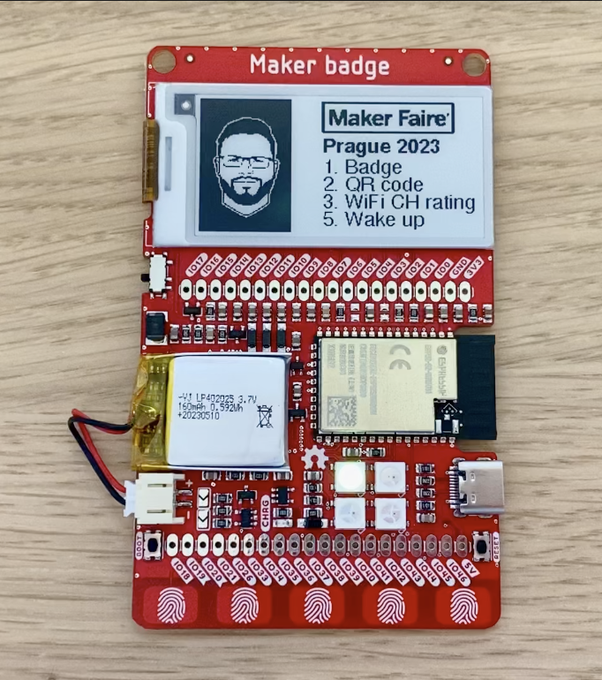

# Maker Badge Firmware - 2023 ESP32-S2

This software has been tested and designed specifically for revision D of the Maker Badge.
Compatibility with other versions or revisions of the Maker Badge is not guaranteed, and the software
may not function as expected when used with other revisions.

Particular attention should be given when working with the power management of the e-ink display.
E-ink displays are sensitive to power conditions, and improper management could potentially damage the display.
Please take special care to avoid powering the e-ink display for extended periods, as this can lead to irreparable
damage.

This software is distributed under the MIT license, and the users are responsible for ensuring appropriate use.
No warranties or guarantees of any kind are provided. :)

This program is inspired and based on a project by Yourigh (Juraj Repcik):
https://github.com/Yourigh/maker_badge_fw/blob/main/LICENSE

To convert images to a format usable in C++, you can use online tools such as the one found at
https://javl.github.io/image2cpp/. This tool allows you to convert bitmap images into byte arrays that can be
directly used in your C++ projects.

PlatformIO Project + CLion
